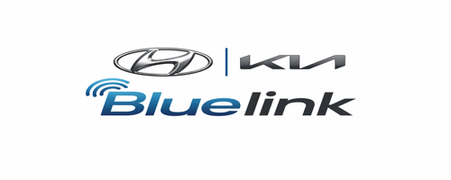

<p align="center">
  
</p>

<h1 align="center">Bluelink Token Generator</h1>

<p align="center">
  Generate Hyundai/Kia Bluelink refresh tokens for
  <a href="https://evcc.io">evcc</a> and
  <a href="https://www.home-assistant.io/">Home Assistant</a> —
  fully automatic, no browser interaction needed.
</p>

<p align="center">
  
  
  
  
</p>

<p align="center">
  <a href="https://github.com/sponsors/TMA84"></a>
</p>

---

## About

Generates Bluelink refresh tokens for EU Kia and EU Hyundai vehicles. Fully **headless** — no browser, no CAPTCHA, no manual interaction. Configure your credentials and the token is generated automatically.

Developed by reverse engineering the official Kia Connect App. Uses `curl_cffi` to impersonate an Android Chrome TLS fingerprint.

### Features

- **Fully headless** — no browser, no Chromium, lightweight container
- **Auto-start** — token generated on container start when credentials are configured
- **Token expiry check** — only renews when the token is about to expire (<14 days)
- **evcc integration** — transfers token to evcc and restarts automatically
- **Simple Web UI** — enter credentials, click "Generate Token"
- Home Assistant token expiry sensor
- Supports `amd64` and `aarch64` (Raspberry Pi, Apple Silicon)

## ☕ Support this project

This project is developed and maintained in my free time. If it saves you time or helps you get your Kia/Hyundai connected, I'd appreciate your support:

<a href="https://github.com/sponsors/TMA84"></a>

## Quick Start

### Home Assistant

→ **[Home Assistant Setup Guide](docs/HOME_ASSISTANT.md)**

[![Open your Home Assistant instance and show the add add-on repository dialog.][repo-badge]][repo-url]

[repo-badge]: https://my.home-assistant.io/badges/supervisor_add_addon_repository.svg
[repo-url]: https://my.home-assistant.io/redirect/supervisor_add_addon_repository/?repository_url=https%3A%2F%2Fgithub.com%2FTMA84%2Fbluelink-refresh-token

### Docker / Podman

→ **[Docker Setup Guide](docs/DOCKER.md)**

```bash
docker run -d --name bluelink-token -p 9876:9876 \
  -e BRAND=eu_kia \
  -e BLUELINK_USERNAME=your@email.com \
  -e BLUELINK_PASSWORD=yourpassword \
  ghcr.io/tma84/bluelink-token:latest /run-standalone.sh
```

## How it works

1. Fetches the RSA public key from Kia/Hyundai
2. Encrypts the password with RSA (same as the official app)
3. POSTs to `/auth/account/signin` with the app's `client_id`
4. Gets the authorization code directly in the 302 redirect
5. Exchanges the code for access and refresh tokens
6. Optionally transfers the token to evcc and restarts it

## Supported Brands

| Value | Brand |
|-------|-------|
| `eu_kia` | Kia (Europe) |
| `eu_hyundai` | Hyundai (Europe) |

Legacy values `kia` and `hyundai` are aliases for `eu_kia` and `eu_hyundai`.

> **Password requirements:** 8–20 characters, at least one uppercase letter, one lowercase letter, one digit, and one special character.

## Where to use the token

Use the refresh token as the **password** (not your Bluelink password) when configuring:

- [evcc](https://docs.evcc.io/en/docs/devices/vehicles#hyundai-bluelink) — Hyundai/Kia vehicle integration
- [Home Assistant Kia/Hyundai integration](https://github.com/Hyundai-Kia-Connect/kia_uvo)

## Support

Got questions or issues? [Open an issue on GitHub.](https://github.com/TMA84/bluelink-refresh-token/issues)

## Credits

Based on [bluelink_refresh_token](https://github.com/RustyDust/bluelink_refresh_token) by RustyDust.

## License

MIT
