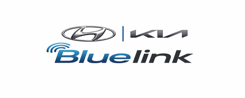

  

<h1 align="center">Bluelink Token Generator</h1>

  Generate Hyundai/Kia Bluelink refresh tokens for
  <a href="https://evcc.io">evcc</a> and
  <a href="https://www.home-assistant.io/">Home Assistant</a> —
  fully automatic, no browser interaction needed.

  
  
  
  

  

---

## About

Generates Bluelink refresh tokens for EU Kia and EU Hyundai vehicles. Fully **headless** — no browser, no CAPTCHA, no manual interaction. Configure your credentials and the token is generated automatically.

Developed by reverse engineering the official Kia Connect App. Uses `curl_cffi` to impersonate an Android Chrome TLS fingerprint.

### Features

- Fully headless — no browser, no Chromium, lightweight container
- Multi-vehicle support (multiple Kia + Hyundai vehicles)
- Auto-renewal with daily expiry checks
- Retry logic for transient login failures
- [evcc integration](docs/EVCC.md) — automatic token transfer + restart
- [kia_uvo integration](docs/KIA_UVO.md) — automatic transfer to HA integration
- [REST API](docs/API.md) for programmatic access
- HA Ingress, token expiry sensors, persistent notifications
- Web UI with dark mode, dynamic vehicle management
- Webhooks + healthcheck endpoint
- Standalone apps for Windows, macOS, Linux
- Supports `amd64` and `aarch64` (Raspberry Pi, Apple Silicon)

## Quick Start

| Your setup | Recommended method |
|---|---|
| Home Assistant OS / Supervised | [Home Assistant Add-on](docs/HOME_ASSISTANT.md) |
| Home Assistant Container (Docker) | [Docker](docs/DOCKER.md) |
| NAS (Synology, QNAP, Unraid) | [Docker](docs/DOCKER.md) |
| No Docker, no Home Assistant | [Standalone App](#standalone-apps-windows-macos-linux) |

→ [API Documentation](docs/API.md)
→ Integrations: [evcc](docs/EVCC.md) | [kia_uvo](docs/KIA_UVO.md)

> **Note:** The Home Assistant Add-on requires **HAOS** or **Supervised**. If you run HA as a Docker container, use the [Docker method](docs/DOCKER.md) instead. This is **not** a HACS integration — it's a standalone tool that generates tokens for use with the [Kia/Hyundai Connect integration](https://github.com/Hyundai-Kia-Connect/kia_uvo).

### Standalone Apps (Windows, macOS, Linux)

No Docker or Python needed — download from the [latest release](https://github.com/TMA84/bluelink-refresh-token/releases/latest), double-click to start.

| Platform | Download | Notes |
|----------|----------|-------|
| **Windows** | `BluelinkTokenGenerator.exe` | No installation needed |
| **macOS** | `BluelinkTokenGenerator-macOS.dmg` | Open DMG, drag to Applications |
| **Linux** | `BluelinkTokenGenerator-Linux.AppImage` | `chmod +x`, then double-click or run from terminal |

Detailed usage instructions

1. Download the file for your platform from the [latest release](https://github.com/TMA84/bluelink-refresh-token/releases/latest)
2. Start the app:
   - **Windows:** Double-click `BluelinkTokenGenerator.exe`
   - **macOS:** Open the `.dmg`, drag "Bluelink Token Generator" to Applications, then launch it
   - **Linux:** Make executable (`chmod +x BluelinkTokenGenerator-Linux.AppImage`) and double-click or run `./BluelinkTokenGenerator-Linux.AppImage`
3. A browser window opens automatically at `http://localhost:9876`
4. Select your brand (Kia or Hyundai), enter your credentials, and click "Generate Token"
5. Copy the refresh token and use it as the password in evcc or Home Assistant

> **macOS:** On first launch, macOS may block the app. Go to System Settings → Privacy & Security and click "Open Anyway".
>
> **Linux:** If double-click doesn't work, your system may need FUSE installed (`sudo apt install libfuse2` on Ubuntu/Debian). Alternatively, run with `--appimage-extract-and-run` flag.

## Supported Brands

| Value | Brand |
|-------|-------|
| `eu_kia` | Kia (Europe) |
| `eu_hyundai` | Hyundai (Europe) |

Legacy values `kia` and `hyundai` are aliases for `eu_kia` and `eu_hyundai`.

> **Password requirements:** 8–20 characters, at least one uppercase letter, one lowercase letter, one digit, and one special character.

## How it works

1. Fetches the RSA public key from Kia/Hyundai
2. Encrypts the password with RSA (same as the official app)
3. POSTs to `/auth/account/signin` with the app's `client_id`
4. Gets the authorization code directly in the 302 redirect
5. Exchanges the code for access and refresh tokens
6. Optionally transfers the token to evcc and restarts it

## FAQ

### I can't find this in HACS

This is not a HACS integration. It's a Home Assistant **Add-on** that requires HAOS or Supervised. If you run HA as a Docker container, use the [Docker setup](docs/DOCKER.md) instead.

### I don't have an Add-on store in Home Assistant

Your HA installation is likely the "Container" type (common on NAS systems). Use the [Docker method](docs/DOCKER.md) — it runs as a separate container alongside your HA.

### Does this work on Synology / QNAP / Unraid?

Yes. Use the [Docker setup](docs/DOCKER.md) — there are NAS-specific instructions for each platform.

### What's the difference between this and the old browser-based scripts?

The old scripts used Selenium/Playwright to automate a real browser. They broke when Kia/Hyundai added bot detection. This tool works **headless** by reverse-engineering the official app's API calls — no browser, no CAPTCHA, no bot detection issues.

### I get "classified as an abusing request and blocked"

This error affects the old browser-based token scripts. This tool uses a different approach (direct API calls with the app's TLS fingerprint) and is not affected by this block.

## ☕ Support this project

This project is developed and maintained in my free time. If it saves you time or helps you get your Kia/Hyundai connected, I'd appreciate your support:

## Credits

Based on [bluelink_refresh_token](https://github.com/RustyDust/bluelink_refresh_token) by RustyDust.

## License

MIT
